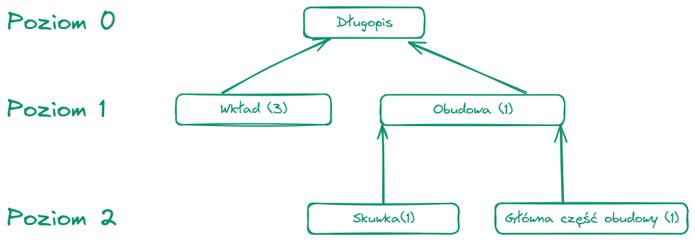

```
# MRP algorythm
> Project carried out as part of the Integrated Systems course

MRP algorithm implementation in Python3 with a simple GUI made with PyQt.

## Product



## Instalation


### From source
```bash
git clone https://github.com/GalaXai/Sys-int.git
cd Sys-int
pip install -r requirements.txt
```

## Usage

### From source
To run the application simply run the following command:
```bash
python main.py
```

### From exe
Just open main.exe file 

This will start the application and you can interact with it throught the GUI.


## Authors
* Szymon Hawryluk 221399
* Justyna Gargula 221391
* Kamila Kapinos 221572
* Eryk Tabiś 222765
```